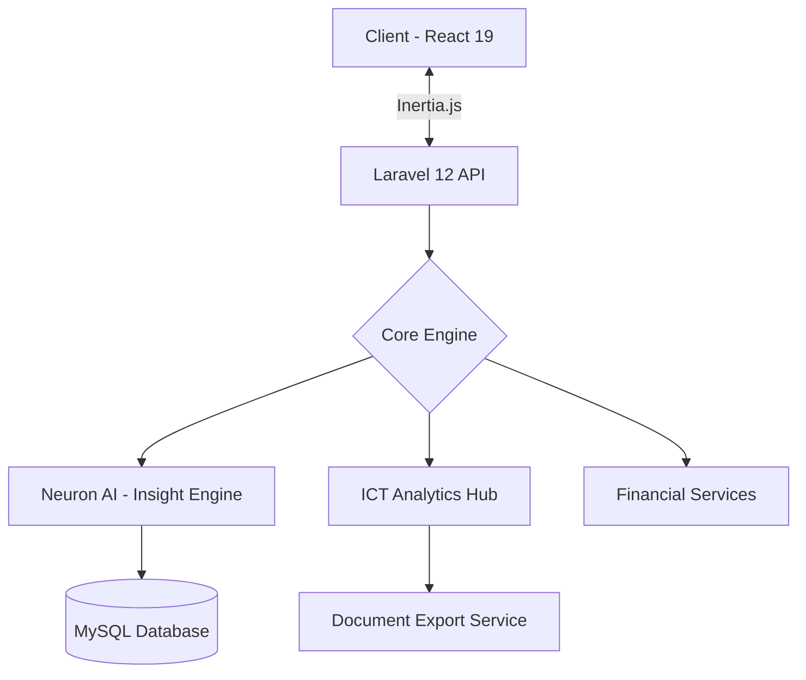

# 🚀 AIRA-LOGIX: Research Intelligence & Analytics

> **Modern System for Research Intelligence, ICT Analytics, and Financial Management.**  
> Built with precision using the latest Laravel and React ecosystems.

---

## 🛠️ Technical Stack & Tools

### **Backend Core** 🐘
- **Framework:** [Laravel 12.x](https://laravel.com) (PHP 8.2+)
- **AI Orchestration:** `neuron-core/neuron-ai` — Powering intelligent data processing and research nodes.
- **Data Handling:** 
  - `PhpSpreadsheet` & `PhpWord` — For automated XLSX/DOCX report generation.
  - `Laravel DomPDF` — High-fidelity PDF document export.
- **DevOps:** Laravel Sail (Docker), PHPUnit, and Pail for real-time logging.

### **Frontend & UX** ⚛️
- **Framework:** [React 19](https://react.dev) with [Inertia.js v2](https://inertiajs.com) (Server-side routing with SPA feel).
- **Styling:** [Tailwind CSS 4.0](https://tailwindcss.com) — Leveraging the latest CSS-first configuration and performance.
- **UI Components:** [Radix UI](https://www.radix-ui.com/) & [Lucide React](https://lucide.dev/) — Accessible, premium interactive elements.
- **Analytics:** [Recharts](https://recharts.org/) — Dynamic data visualization for ICT trends.
- **Diagramming:** [Mermaid.js](https://mermaid.js.org/) — Integrated workflows and architecture visualization.

---

## 🏗️ System Architecture



---

## 🔥 Key Features

- **📊 ICT Analytics Dashboard:** Comprehensive monitoring of service requests with deep filtering (status, type, priority).
- **🧠 Research Intelligence:** AI-powered knowledge graph and image extraction for automated data collection.
- **💸 Financial Management:** Advanced loan tracking with dynamic toggle views (Grid vs. Table layouts) and expense management.
- **📄 Multi-Format Reporting:** Exporting filtered datasets directly to **Excel, CSV, and PDF** for professional audits.
- **🌗 Unified UI:** Fully responsive, premium dashboard supporting adaptive light/dark modes.

---

## 🚀 Getting Started

### 1. Prerequisites
- **PHP** 8.2+
- **Node.js** 20+
- **Composer** & **NPM**

### 2. Installation

```bash
# Clone the repository
git clone https://github.com/zynxoso/CLSU_AIRA-LOGIX.git

# Install PHP dependencies
composer install

# Install JS dependencies
npm install

# Setup environment
cp .env.example .env
php artisan key:generate

# Run development servers
php artisan dev
```

### 3. Build for Production
```bash
npm run build
php artisan migrate --force
```

---

## 📁 Project Structure

```text
├── app/                  # Core Business Logic (Models, Controllers)
├── resources/js/         # React Components & Inertia Pages
├── database/             # Migrations & Seeders
├── config/               # System Configurations
└── public/               # Static Assets
```

---

## 🛡️ Security & Performance

- **CSRF & XSS Protection:** Native Laravel and React sanitization.
- **Core Web Vitals:** Optimized bundle sizes via Vite.
- **Zero-Downtime Ready:** Configured for safe production rollouts.

---

**Built by [zynxoso](https://github.com/zynxoso)**  
*Transforming research data into actionable intelligence.*
