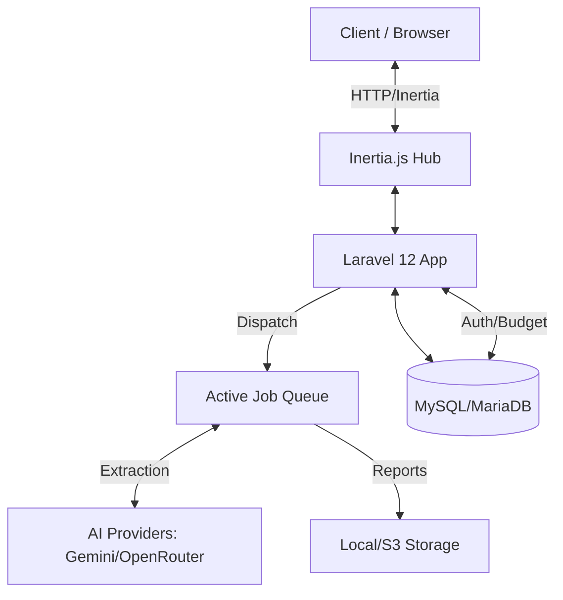
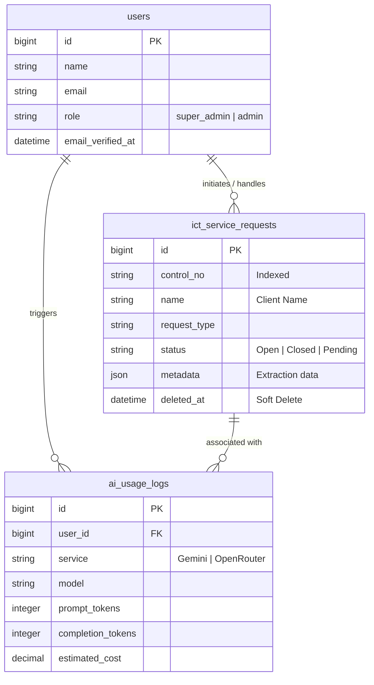

# AIRA-LOGIX Technical Documentation

## Executive Summary
AIRA-LOGIX is a high-performance Laravel 12 application utilizing a React 19 frontend via Inertia.js 2.0. It is designed for ICT departments to digitize service request workflows, extract structured data from diverse inputs (photos, docs, sheets) using Google Gemini AI, and generate comprehensive analytical reports.

---

## 1. Core Features

- **Inertia-Powered SPA**: Fast, fluid dashboard and form flows without full page reloads.
- **Multi-Source AI Extraction**: Smart Scan handles images (Gemini Vision), Word files, and Spreadsheets.
- **Fail-Safe AI Orchestration**: Automatic provider fallback (Gemini -> OpenRouter) with budget guardrails.
- **Robust Reporting**: Dynamically filled Word templates, bulk ZIP exports, and interactive Recharts-based analytics.
- **Enterprise Security**: Encrypted sensitive data, role-based access (ACL), and secure session management.

## 2. Technical References

For deep-dives into specific sub-systems, refer to:
- [13_AI_Orchestration_Reference.md](./13_AI_Orchestration_Reference.md): AI providers, fallbacks, and budget logic.
- [14_API_Endpoint_Guide.md](./14_API_Endpoint_Guide.md): Detailed route and controller mapping.
- [15_Frontend_Architecture.md](./15_Frontend_Architecture.md): React 19, Inertia 2.0, and Tailwind v4 setup.

---

## 3. Key Files and Directories

### Backend (PHP/Laravel)
- **Controllers**: `app/Http/Controllers/` (Request handling and page rendering).
- **Services**: `app/Services/` (Core logic: extraction, templating, AI orchestration).
- **Jobs**: `app/Jobs/` (Background processing for long-running AI tasks and exports).
- **Models**: `app/Models/` (Database schema and business logic).

### Frontend (TypeScript/React)
- **Pages**: `resources/js/pages/` (Individual screen implementations).
- **Components**: `resources/js/components/` (Shared UI modules like forms, sidebars, and toasts).
- **Styles**: `resources/css/app.css` (Tailwind v4 theme and global styles).

---

## 4. System Architecture Overview

## 5. Persistence Design (ERD)

## 6. Security & Governance

- **RBAC**: Users are assigned roles (regular, super_admin) with fine-grained permissions.
- **AI Budget**: Monthly USD spending limits enforced at the orchestration level.
- **Data Privacy**: Field-level encryption for sensitive ICT request data.
- **Rate Limiting**: Throttled API endpoints for extraction and export attempts.

---

## 6. Setup & Development

- **Environment**: Copy `.env.example` to `.env` and configure `GEMINI_API_KEY`.
- **Database**: Run `php artisan migrate` to set up tables.
- **Frontend**: Run `npm install` and `npm run dev` for the Vite server.
- **Queues**: Run `php artisan queue:work` to process AI extractions and exports.
---

## 8. Development Guidelines

1. **Maintain Consistency**: Align route, page, and controller naming.
2. **Shift Complexity**: Keep logic inside Services or Jobs; keep Controllers and React components lean.
3. **Document as You Build**: Update the specific guides (AI, API, Frontend) when adding major features.
4. **Test Patterns**: Use Laravel Pest/PHPUnit for backend and Vitest/Testing Library for frontend.

