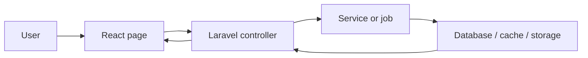
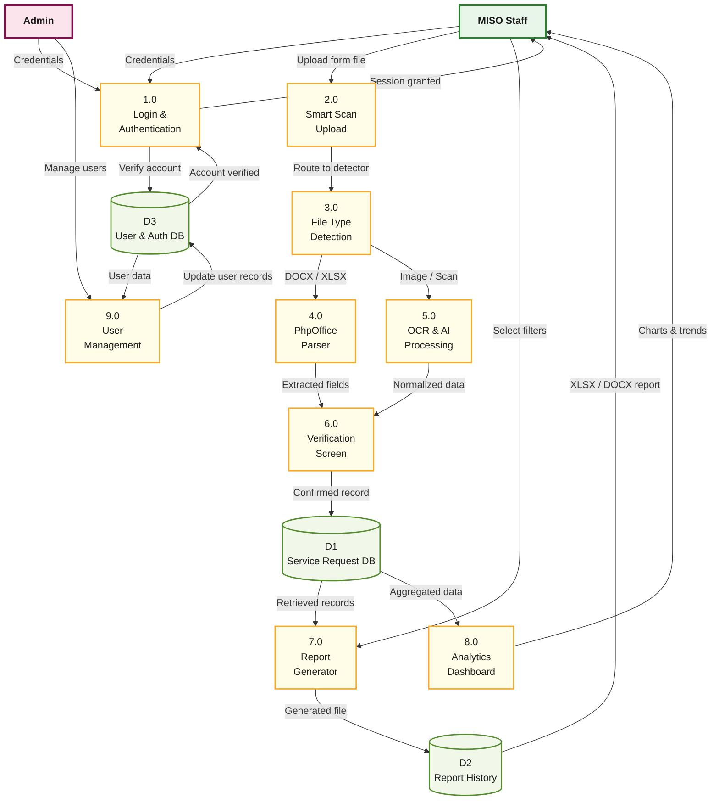

# AIRA-LOGIX Architecture Reference

## Executive Summary
AIRA-LOGIX uses a Laravel backend with a React frontend delivered through Inertia.js. The browser renders pages from `resources/js`, Laravel controllers coordinate requests, services perform extraction and export work, and jobs handle long-running tasks.

## 1. The Three Layers

- **Presentation**: React pages, layouts, and shared components in `resources/js/pages`, `resources/js/layouts`, and `resources/js/components`.
- **Application**: Controllers, middleware, providers, jobs, and services in `app/Http`, `app/Jobs`, `app/Services`, `app/Providers`, and `app/Http/Middleware`.
- **Persistence**: Eloquent models, migrations, cache, and storage.

## 2. Component Roles

- **Dashboard page**: `resources/js/pages/dashboard.tsx` handles listing, filtering, and actions.
- **Intake page**: `resources/js/pages/intake.tsx` handles upload and review.
- **Smart Scan page**: `resources/js/pages/smart-scan.tsx` handles direct extraction from the browser.
- **Request form component**: `resources/js/components/ict-request-form.tsx` is the shared create/edit form.
- **Documentation page**: `resources/js/pages/documentation.tsx` reads the markdown docs.
- **Super Admin pages**: `resources/js/pages/superadmin/dashboard.tsx` and `resources/js/pages/superadmin/user-management.tsx` manage admin tools.

## 4. AI Orchestration Layer

The AI logic is decoupled from the UI and Controllers via the **Orchestration Layer**:
- **Gateway**: `app/Services/AiOrchestrator.php` handles all model calls.
- **Enforcement**: `app/Services/AiBudgetManager.php` prevents overspending.
- **Extraction**: Specialized services in `app/Services/Extraction/` handle file-specific parsing (PDF, DOCX, XLSX).

Refer to [13_AI_Orchestration_Reference.md](./13_AI_Orchestration_Reference.md) for more.

## 3. Communication Flow

## 6. Data Flow Diagram (DFD)

## 4. Key Rules of the House

- React is the UI layer.
- Inertia bridges the frontend and Laravel controllers.
- Heavy extraction and export tasks should run in jobs.
- Authentication and permissions gate access to internal pages.
- Sensitive request fields are encrypted at rest.
- AI usage is tracked and budget-limited.

## 5. Finding Your Way Around

- `/login`: `resources/js/pages/auth/login.tsx`
- `/dashboard`: `resources/js/pages/dashboard.tsx`
- `/dashboard/intake`: `resources/js/pages/intake.tsx`
- `/dashboard/smart-scan`: `resources/js/pages/smart-scan.tsx`
- `/dashboard/documentation`: `resources/js/pages/documentation.tsx`
- `/dashboard/reports`: `resources/js/pages/reports.tsx`
- `/dashboard/ai-consumption`: `resources/js/pages/ai-consumption.tsx`
- `/requests/{id}/edit`: `resources/js/pages/requests/edit.tsx`
- `/superadmin/dashboard`: `resources/js/pages/superadmin/dashboard.tsx`
- `/superadmin/users`: `resources/js/pages/superadmin/user-management.tsx`

---
