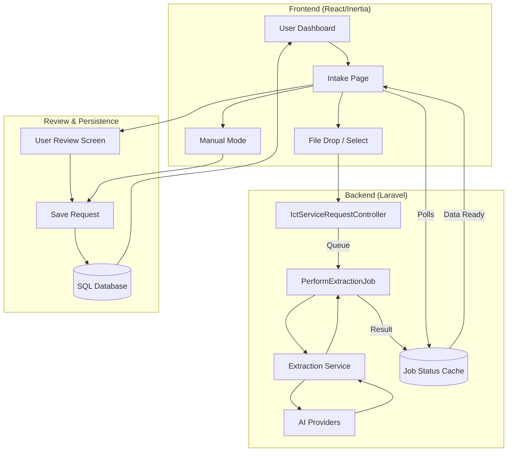

# Form Automation Flow (Current)

## Executive Summary
This document covers the current React/Inertia form workflow: intake, smart scan, manual create/edit, dashboard actions, and the controller/job/service chain behind each flow.

## 1. Intake flow (upload then save)

Main files:

- `resources/js/pages/intake.tsx`
- `resources/js/components/snap-to-log-banner.tsx`
- `app/Http/Controllers/IctServiceRequestController.php`
- `app/Jobs/PerformExtractionJob.php`

Flow:

1. User opens `/dashboard/intake`.
2. The page renders `SnapToLogBanner` and `ICTRequestForm`.
3. The user uploads a supported file.
4. The controller stores a temp file and dispatches `PerformExtractionJob`.
5. The UI polls the extraction status endpoint until extraction is complete.
6. The user reviews extracted data and confirms save.
7. The system stores the record in `ict_service_requests`.

Supported upload extensions:

- documents: `doc`, `docx`, `csv`, `xlsx`, `xls`
- images: `jpg`, `jpeg`, `png`, `webp`

## 2. Extraction decisions

Main files:

- `app/Jobs/PerformExtractionJob.php`
- `app/Services/IctImageExtractionService.php`
- `app/Services/IctExtractionService.php`

- If file type is image, the job uses `IctImageExtractionService`.
- If file type is document, the job uses `IctExtractionService`.
- Spreadsheet files can return multiple rows for bulk import.
- Job status and result are saved in cache.

## 3. Save behavior

Main file:

- `app/Http/Controllers/IctServiceRequestController.php`

- If there is bulk data, the controller stores rows in batch.
- If there is single extracted data, the controller saves one record.
- The save flow uses validation and database transactions for safety.

## 4. Manual create flow

Main files:

- `resources/js/components/ict-request-form.tsx`
- `resources/js/pages/intake.tsx`
- `app/Http/Controllers/IctServiceRequestController.php`

1. User opens the intake page or create flow.
2. The request form is filled manually.
3. The form validates required values and confirms before save.
4. The controller creates one record.

Extra feature:

- The create flow can use image prefill through `IctImageExtractionService`.
- Returned values are merged into the form state.

## 5. Manual edit flow

Main files:

- `resources/js/pages/requests/edit.tsx`
- `resources/js/components/ict-request-form.tsx`
- `app/Http/Controllers/IctServiceRequestController.php`

1. User opens `/requests/{id}/edit`.
2. The page loads the record data.
3. User edits and confirms.
4. The controller updates that record.

## 6. Dashboard flow

Main files:

- `resources/js/pages/dashboard.tsx`
- `app/Http/Controllers/DashboardController.php`
- `app/Http/Controllers/IctServiceRequestController.php`

Main actions:

- search and filter
- inline update on allowed fields only
- bulk delete, restore, and export actions

## 7. Export flow

Used files:

- `resources/js/pages/dashboard.tsx`
- `app/Jobs/GenerateExportJob.php`
- `app/Services/LogSyncService.php`
- `app/Services/IctTemplateService.php`

Rules:

- `xlsx` and `csv` use `LogSyncService`
- `zip` uses `IctTemplateService` to create many `docx` files

## 8. Detailed System Interaction Flow

