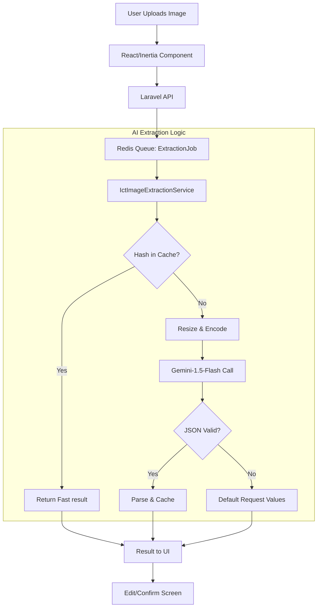

# Image Extraction Workflows (Current)

## Executive Summary
This document explains how image files are handled by the current React/Inertia intake and smart scan flows. The frontend uploads the file, the backend job runs extraction, and the UI polls for the result.

## 1. Supported image types

- `jpg`
- `jpeg`
- `png`
- `webp`

## 2. Where image extraction is used

- `resources/js/pages/intake.tsx`
- `resources/js/pages/smart-scan.tsx`
- `resources/js/components/snap-to-log-banner.tsx`
- `resources/js/components/ict-request-form.tsx`
- `app/Http/Controllers/IctServiceRequestController.php`

## 3. Service used

- `app/Services/IctImageExtractionService.php`

Main behavior:

- checks cache first using a SHA-256 hash of the file
- optionally resizes large images
- sends the image to Gemini
- requests JSON-only output
- parses the response into an array
- stores successful results in cache
- logs AI usage and budget activity through the AI services

## 4. Safety behavior

- uses a circuit-breaker style limiter to prevent repeated failures
- returns fallback data when extraction fails
- fallback includes:
  - `request_description`: manual entry needed message
  - `request_type`: `ICT Technical Support`
  - `status`: `Open`
  - `name`: `Extraction Failed`

## 5. Vision-to-Data Flow

## 6. Intake page image flow

1. User uploads an image on `resources/js/pages/intake.tsx`.
2. The controller stores the upload temporarily.
3. `PerformExtractionJob` uses the image service.
4. The job result is stored in cache by job ID.
5. The frontend polls the status endpoint and shows the result.
6. The user confirms save.

## 7. Smart Scan flow

1. User opens `resources/js/pages/smart-scan.tsx`.
2. The page uploads a file directly through the controller endpoint.
3. The backend dispatches extraction work.
4. The page polls until the file is ready.
5. The user saves the extracted data.

## 8. Common failure cases

- API key missing or invalid
- network error while calling Gemini
- response not valid JSON
- low quality image

When these happen, the user can retry with a clearer image.

## 9. Not found in repo

- Backup OCR is not active yet. `app/Services/Ocr/TesseractOcrService.php` is an empty stub and is not part of the active extraction flow.
