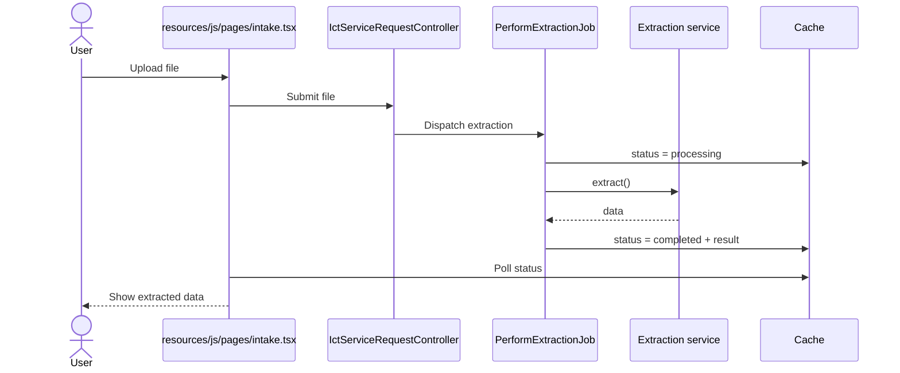
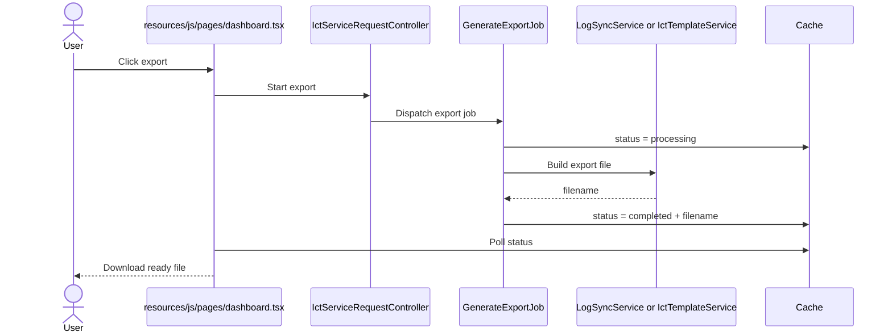

# User and Developer Guide (Current)

## Executive Summary
This guide maps the current React/Inertia screens, the Laravel controllers behind them, and the main services/jobs used for extraction, export, and documentation.

## 1. For users

### Login and main pages

- Login page: `/login`
- Main dashboard: `/dashboard`
- Intake page: `/dashboard/intake`
- Smart Scan page: `/dashboard/smart-scan`
- Documentation page: `/dashboard/documentation`
- Reports page: `/dashboard/reports`
- AI consumption page: `/dashboard/ai-consumption`
- Request edit page: `/requests/{id}/edit`
- Super Admin dashboard: `/superadmin/dashboard`
- Super Admin user management: `/superadmin/users`

### Common tasks

1. Upload and extract from a file
   - Go to the intake or smart scan page
   - Upload a supported file
   - Wait for extraction
   - Review the result
   - Confirm save
2. Create manually
   - Open the request form page
   - Fill the fields
   - Confirm save
3. Edit a record
   - Open the request edit page
   - Change values
   - Save
4. Export data
   - Use export controls on the dashboard
   - Wait until export is ready
   - Download the file

---

## 2. For developers

### Main files to know

- Pages
  - `resources/js/pages/dashboard.tsx`
  - `resources/js/pages/intake.tsx`
  - `resources/js/pages/smart-scan.tsx`
  - `resources/js/pages/documentation.tsx`
  - `resources/js/pages/reports.tsx`
  - `resources/js/pages/ai-consumption.tsx`
  - `resources/js/pages/requests/edit.tsx`
- Shared components
  - `resources/js/components/ict-request-form.tsx`
  - `resources/js/components/snap-to-log-banner.tsx`
  - `resources/js/components/app-sidebar.tsx`
  - `resources/js/components/nav-main.tsx`
  - `resources/js/components/flash-toasts.tsx`
- Controllers
  - `app/Http/Controllers/DashboardController.php`
  - `app/Http/Controllers/IctServiceRequestController.php`
  - `app/Http/Controllers/DocumentationController.php`
  - `app/Http/Controllers/AnalyticsController.php`
  - `app/Http/Controllers/AiConsumptionController.php`
- Jobs
  - `app/Jobs/PerformExtractionJob.php`
  - `app/Jobs/GenerateExportJob.php`
- Services
  - `app/Services/IctExtractionService.php`
  - `app/Services/IctImageExtractionService.php`
  - `app/Services/IctTemplateService.php`
  - `app/Services/LogSyncService.php`
- Model
  - `app/Models/IctServiceRequest.php`

### Intake + extraction sequence

### Export sequence

## 3. Spreadsheet behavior

`LogSyncService` maps header labels to database fields.

Import behavior:

- reads rows from the active sheet
- maps headers to known fields
- uses `updateOrCreate`
- identifier priority:
  - `control_no`
  - fallback: `timestamp_str` + `client_feedback_no`

Note:

- `name` is encrypted at rest, so it is not used as a dedupe key.

Export behavior:

- writes spreadsheet headers from mapping keys
- writes values row by row from model fields
- supports `xlsx` and `csv`

## 4. Word output behavior

`IctTemplateService` fills the official template:

- template path: `docs/ICT Service Request Form.docx`
- output path: `storage/app/public/reports/`
- supports single DOCX output and bulk DOCX ZIP output

## 5. Current warnings

- Some older docs referenced removed screens that are no longer active.
- The current app flow is React/Inertia-based and job-based for long tasks.

---

