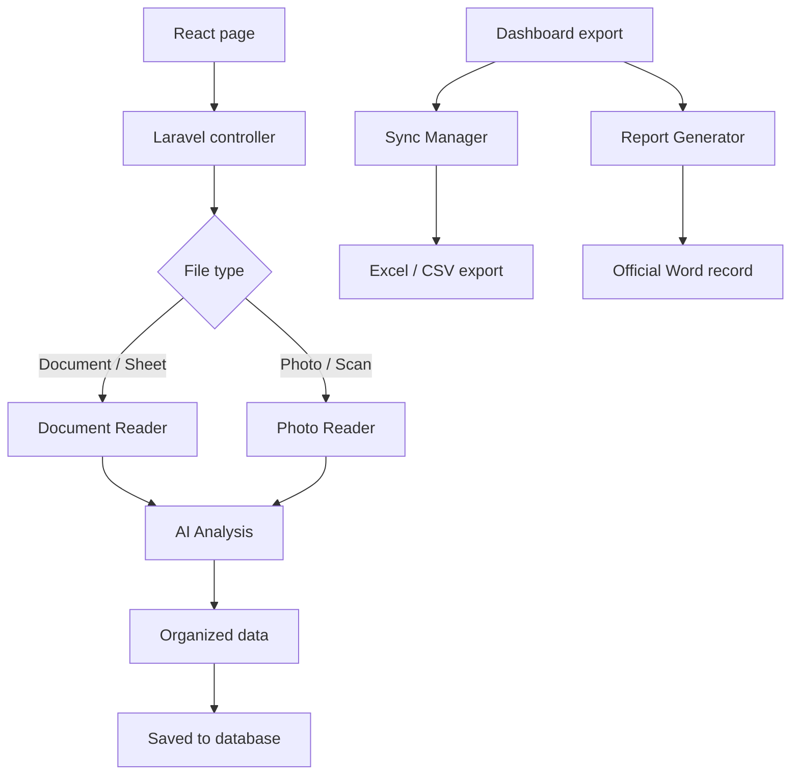

# Code Reference: Services (Current)

## Executive Summary
This file describes the backend services that power extraction, image processing, template filling, and spreadsheet import/export. These classes are the core logic layer behind the React/Inertia screens.

## 1. Document Reader (Spreadsheet and Word)

Main job:

- reads Word documents and spreadsheet files
- extracts text and structured data
- maps content into service request fields using Gemini-assisted parsing

Main files:

- `app/Services/IctExtractionService.php`
- `app/Services/Extraction/SpreadsheetExtractor.php`
- `app/Services/Extraction/DocxTextExtractor.php`
- `app/Services/Extraction/DocxCheckboxExtractor.php`
- `app/Services/Extraction/AiParserService.php`

## 2. Photo Reader (Image Extraction)

Main job:

- reads data from photos of paper forms
- hashes images for cache lookup
- optionally resizes large images
- sends the image to Gemini Vision
- returns structured data or a fallback payload

Main files:

- `app/Services/IctImageExtractionService.php`
- `app/Services/Extraction/ImageOptimizer.php`
- `app/Services/Extraction/AiVisionService.php`

## 3. Report Generator (Template Filling)

Main job:

- fills the official Word template with saved request data
- handles checkbox marking for request type and status
- supports single DOCX output and bulk ZIP output

Main file:

- `app/Services/IctTemplateService.php`

## 4. Sync Manager (Import and Export)

Main job:

- imports spreadsheet rows safely
- exports records to `XLSX` and `CSV`
- avoids duplicates using control numbers and fallback identifiers

Main file:

- `app/Services/LogSyncService.php`

## 5. AI Budget and Usage Tracking

Main job:

- enforces AI budget guardrails
- logs usage metadata for auditing and reporting
- supports monitoring from the admin area

Main files:

- `app/Services/AiBudgetManager.php`
- `app/Models/AiUsageLog.php`

## 6. Background Workers

Main job:

- performs long-running extraction and export tasks off the request thread

Main files:

- `app/Jobs/PerformExtractionJob.php`
- `app/Jobs/GenerateExportJob.php`

## 7. Not Found / Not Active

- Backup OCR is not implemented yet. `app/Services/Ocr/TesseractOcrService.php` is an empty stub.

## 8. How the Tools Talk to Each Other

---

