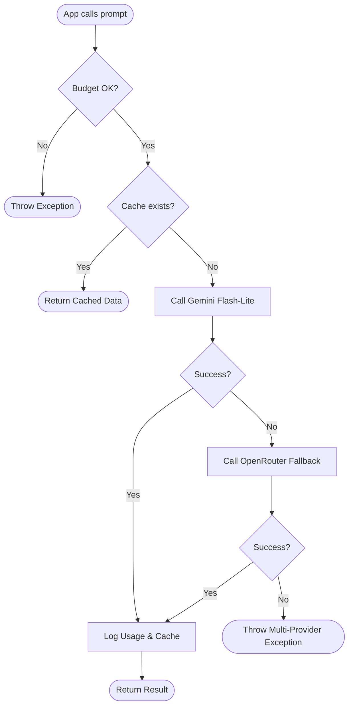
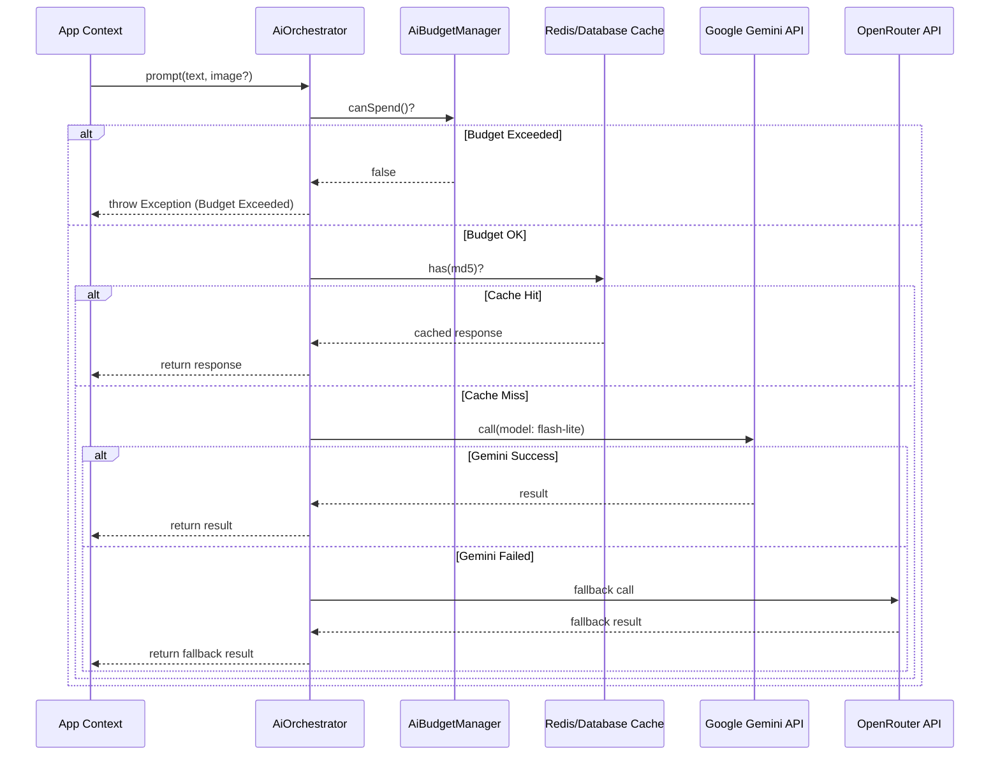

# AI Orchestration Reference

This document details the AI orchestration layer in AIRA-LOGIX, which manages multiple AI providers, budget enforcement, and fallback logic.

## 1. Core Component: `AiOrchestrator`

The `App\Services\AiOrchestrator` class is the central gateway for all AI-powered tasks (extraction, parsing, classification).

### Key Features:
- **Budget Check**: Validates if the monthly AI budget allows for further spending.
- **Provider Fallback**: If Gemini fails (timeout or error), the system automatically attempts to use OpenRouter as a fallback.
- **Caching**: Repeat prompts with identical content/images are cached for 7 days (if enabled in `.env`).
- **Usage Logging**: Detailed logs of prompt/completion tokens and estimated costs are saved to the `ai_usage_logs` table.

### Main Method: `prompt`

```php
public function prompt(
    string $prompt, 
    array $options = [], 
    ?string $base64Image = null, 
    ?string $mimeType = null, 
    ?string $systemPrompt = null
): string
```

**Parameters:**
- `$prompt`: The primary instruction for the AI.
- `$options`: Reserved for future model parameters (e.g., temperature).
- `$base64Image`: (Optional) Base64 encoded image content for Gemini Vision.
- `$mimeType`: (Optional) The mime type of the image.
- `$systemPrompt`: (Optional) System instructions to guide the AI behavior.

## 2. Budget Management: `AiBudgetManager`

`App\Services\AiBudgetManager` ensures that AI spending stays within defined limits.

- **Threshold**: Set via `AI_BUDGET_THRESHOLD` in `.env`.
- **Status Check**: `AiBudgetManager::canSpend()` returns `true` if current monthly usage is below the threshold.
- **Cost Estimation**: Simple token-based estimations are used to track approximate USD spending.

## 3. High-Level Logic Flow



## 4. Interaction Sequence



## 4. Usage Logging

Every successful AI call logs data to `App\Models\AiUsageLog`:
- `service`: 'gemini' or 'openrouter'
- `model`: Specific model name used.
- `prompt_tokens`: Estimated input tokens (length / 4).
- `completion_tokens`: Estimated output tokens.
- `estimated_cost`: Cost calculated per 1k tokens.

## 5. Environment Configuration

```bash
# Model Settings
GEMINI_MODEL=gemini-3.1-flash-lite-preview
OPENROUTER_MODEL=google/gemini-3.1-flash-lite-preview-exp:free

# Budget Settings
AI_BUDGET_THRESHOLD=50.00  # Monthly limit in USD

# Cache Settings
AI_CACHE_ENABLED=true
```
